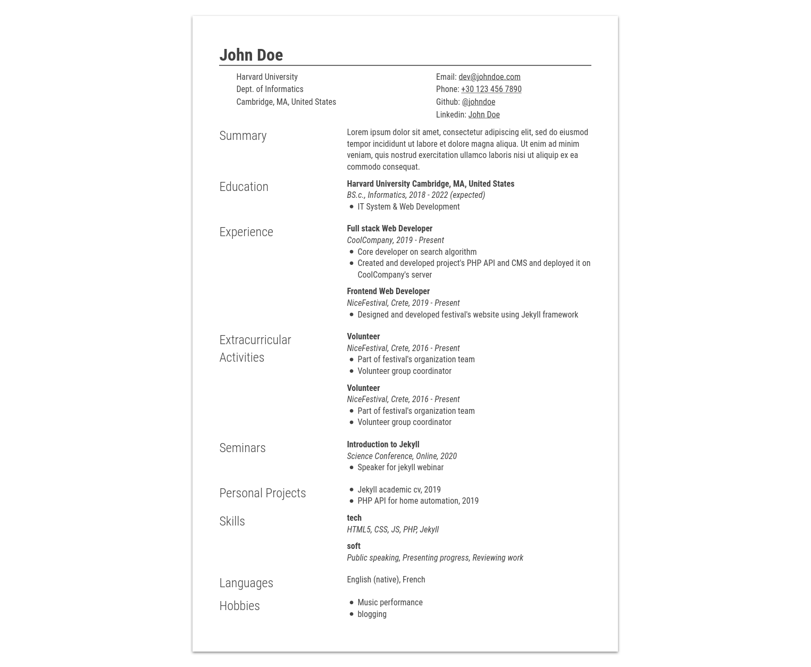

# academic-cv-jekyll

A simple academic cv template inspired by latex documents made for jekyll. Also github pages compatible!



## Installation

Start with a valina jekyll project

```bash
mkdir cv && cd cv
bundle init
```

Add this line to your Jekyll site's `Gemfile`:

```ruby
gem "jekyll"
gem "academic-cv-jekyll"
```

And add this line to your Jekyll site's `_config.yml`:

```yaml
title: Your site's title
theme: academic-cv-jekyll
```

And then execute:

    $ bundle

Or install it yourself as:

    $ gem install academic-cv-jekyll

## Usage

1. Create an index page or copy the one that is in the repository and modify it as you like.
2. Create a `_data` folder with a file named `cv.yml` or copy the one that is in the repository and modify it as you like.


## License

The theme is available as open source under the terms of the [MIT License](https://opensource.org/licenses/MIT).

